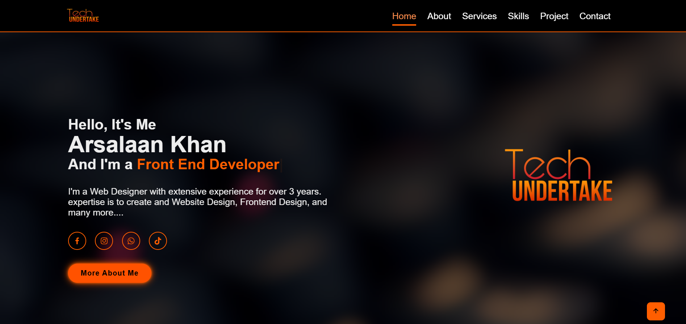
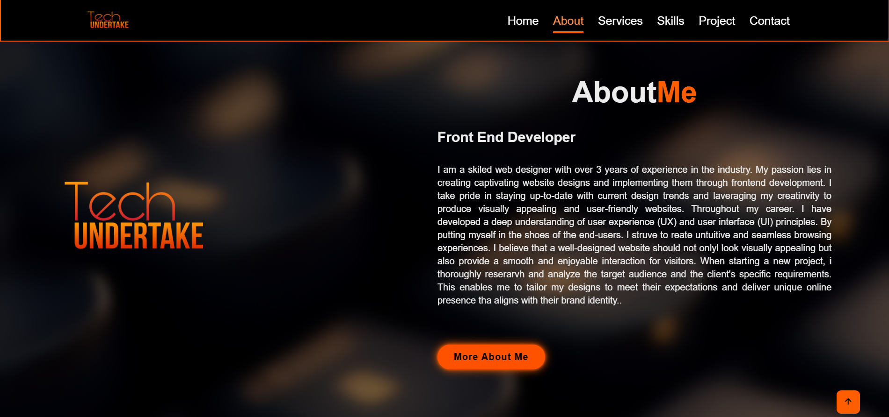
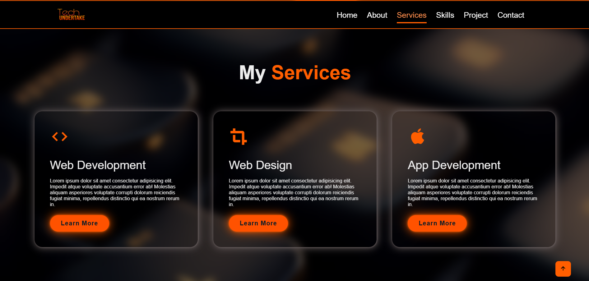
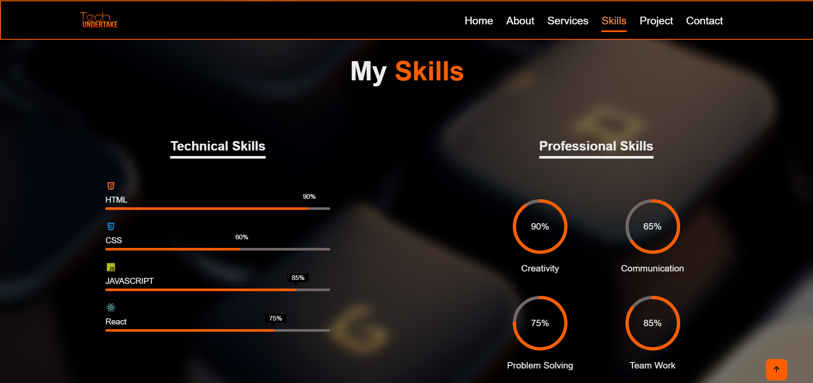
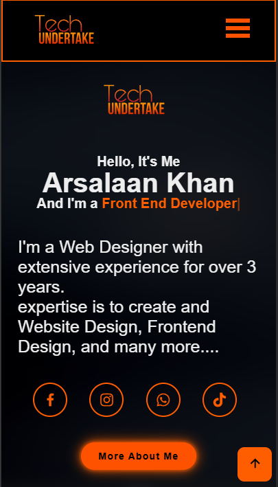
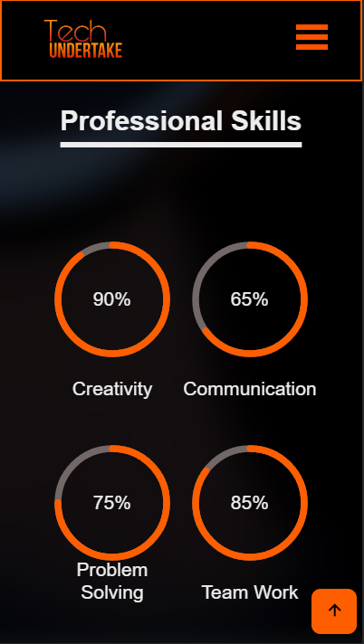

# 🚀 Tech Undertake Portfolio

<div align="center">

<!--  -->

**A modern, responsive portfolio website showcasing web development expertise and creative projects.**

<!-- [](https://app.netlify.com/sites/YOUR-SITE-NAME/deploys) -->
[](https://developer.mozilla.org/en-US/docs/Web/HTML)
[](https://developer.mozilla.org/en-US/docs/Web/CSS)
[](https://developer.mozilla.org/en-US/docs/Web/JavaScript)
[](https://reactjs.org/)

[🌐 Live Demo](https://techundetakeportfolio.netlify.app/)

</div>

---

## 📖 Overview

Tech Undertake Portfolio is a professionally designed personal portfolio website that showcases my journey as a **Front End Developer** with over 3 years of experience in web design and development. The portfolio features an elegant dark theme with vibrant orange accents, smooth animations, and a fully responsive design that delivers an exceptional user experience across all devices.

This project demonstrates proficiency in modern web development practices, including clean code architecture, responsive design principles, and interactive user interfaces.

---

## ✨ Key Features

### 🎨 **Modern Design**
- **Dark Theme**: Sleek black background with vibrant orange (#ff5e00) accent colors
- **Glassmorphism Effects**: Backdrop blur effects for a premium, modern appearance
- **Smooth Animations**: Custom CSS animations with keyframes for engaging user interactions
- **Responsive Layout**: Fully optimized for desktop, tablet, and mobile devices

### 📱 **Responsive Navigation**
- **Desktop Navigation**: Fixed header with smooth scroll-to-section functionality
- **Mobile Navigation**: Hamburger menu with animated transitions
- **Active State Tracking**: Intersection Observer API for automatic navigation highlighting
- **Smooth Scrolling**: Seamless section transitions throughout the page

### 🎯 **Interactive Sections**
1. **Home**: Dynamic typing animation showcasing professional roles
2. **About**: Detailed background and professional summary
3. **Services**: Grid-based service cards with hover effects
4. **Skills**: 
   - Technical Skills: Animated progress bars (HTML, CSS, JavaScript, React)
   - Professional Skills: Radial progress indicators (Creativity, Communication, Problem Solving, Team Work)
5. **Projects**: Portfolio showcase with interactive overlays and external links
6. **Contact**: Professional contact form with social media integration

### 🌟 **Special Features**
- **Typed.js Integration**: Auto-typing animation for dynamic text
- **Boxicons**: Clean, modern icon library for visual elements
- **Social Media Links**: Integrated social profiles with hover animations
- **Back to Top**: Smooth scroll-to-top functionality
- **Project Previews**: Embedded demo projects (Coffee Shop & Snack websites)

---

## 🛠️ Technologies Used

### **Frontend Stack**
- **HTML5**: Semantic markup and modern web standards
- **CSS3**: Advanced styling with animations and responsive design
  - CSS Grid & Flexbox for layout
  - Custom animations and transitions
  - Backdrop filters for glassmorphism
  - Media queries for responsiveness
- **JavaScript (ES6+)**: Modern vanilla JavaScript
  - Intersection Observer API
  - Event handling and DOM manipulation
  - Dynamic content management

### **Libraries & Tools**
- **[Typed.js](https://github.com/mattboldt/typed.js/)** (v2.0.16): Typing animation library
- **[Boxicons](https://boxicons.com/)** (v2.1.4): Premium icon set
- **[Google Fonts](https://fonts.google.com/)**: Poppins font family

### **Deployment**
- **[Netlify](https://techundetakeportfolio.netlify.app/)**: Continuous deployment and hosting platform

---

## 📂 Project Structure

```
Tech Undertake Portfolio/
│
├── images/                      # Image assets and screenshots
│   ├── Tech Undertak Logo.png
│   ├── Coffee Website Image.png
│   ├── Snack Website Image.png
│   ├── braille.jpg             # Background texture
│   └── ...
│
├── Websites/                    # Embedded demo projects
│   ├── Coffee Website/
│   │   ├── css/
│   │   ├── images/
│   │   ├── index.html
│   │   └── script.js
│   │
│   └── Snack Website/
│       ├── css/
│       ├── images/
│       └── index.html
│
├── index.html                   # Main HTML file
├── style.css                    # Main stylesheet (1200+ lines)
├── app.js                       # JavaScript functionality
└── README.md                    # Project documentation

```

<!-- ---

## 🚀 Getting Started

### Prerequisites
- A modern web browser (Chrome, Firefox, Safari, Edge)
- Basic text editor (VS Code, Sublime Text, etc.)
- (Optional) Live Server extension for local development

### Installation

1. **Clone the repository**
   ```bash
   git clone https://github.com/Arsalaan-Khan-22/techundertake-portfolio-website.git
   ```

2. **Navigate to project directory**
   ```bash
   cd techundertake-portfolio-website
   ```

3. **Open in browser**
   - Double-click `index.html`, or
   - Use Live Server extension in VS Code, or
   - Run a local server:
     ```bash
     # Python 3
     python -m http.server 8000
     
     # Node.js (with http-server)
     npx http-server
     ```

4. **Access the website**
   - Local file: `file:///path/to/index.html`
   - Live Server: `http://localhost:5500`
   - HTTP Server: `http://localhost:8000`

--- -->

<!-- ## 🌐 Deployment

This portfolio is deployed on **Netlify** for fast, reliable hosting with continuous deployment.

### Deploy Your Own Copy

1. **Fork this repository**

2. **Connect to Netlify**
   - Sign up at [Netlify](https://www.netlify.com/)
   - Click "New site from Git"
   - Select your forked repository
   - Configure build settings:
     - Build command: (leave empty for static site)
     - Publish directory: `/`
   - Click "Deploy site"

3. **Update README badges**
   - Replace `YOUR-BADGE-ID` and `YOUR-SITE-NAME` with your Netlify details

4. **Custom Domain** (Optional)
   - Go to Site settings → Domain management
   - Add your custom domain

--- -->

## 💡 Key Technical Highlights

### Intersection Observer Implementation
```javascript
// Automatic navigation highlighting based on scroll position
const observer = new IntersectionObserver(callback, options);
sections.forEach((section) => observer.observe(section));
```

### Responsive Navigation System
- Desktop: Fixed header with inline navigation
- Mobile: Hamburger menu with slide-down animation
- Automatic active state tracking on scroll

### CSS Animation Architecture
- Custom keyframe animations (`slideright`, `slideleft`, `slidetop`, `slidedown`)
- Staggered animations using CSS variables (`--i`)
- Animated progress bars and radial indicators

### Performance Optimizations
- Minimal external dependencies
- Optimized CSS with efficient selectors
- Lazy-loaded animations on scroll
- Responsive images and assets

---

## 📱 Responsive Breakpoints

| Device | Breakpoint | Layout Changes |
|--------|-----------|----------------|
| **Desktop** | > 768px | Fixed navigation, two-column layouts |
| **Tablet/Mobile** | ≤ 768px | Hamburger menu, single-column layouts |

---

<!-- ## 🎨 Color Palette

| Color | Hex Code | Usage |
|-------|----------|-------|
| **Primary Orange** | `#ff5e00` | Accents, borders, highlights |
| **Light Orange** | `#ff8e4d` | Hover states, active links |
| **Dark Background** | `#000000` | Main background |
| **Text Light** | `#ededed` | Primary text color |
| **Muted Gray** | `#726868` | Secondary elements, borders | -->

---

## 📸 Screenshots

<!-- > **Note**: Add screenshots of your portfolio sections here -->

### Desktop View





### Mobile View



---

<!-- ## 🤝 Contributing

Contributions, issues, and feature requests are welcome! Feel free to check the [issues page](https://github.com/Arsalaan-Khan-22/techundertake-portfolio-website/issues).

### How to Contribute
1. Fork the project
2. Create your feature branch (`git checkout -b feature/AmazingFeature`)
3. Commit your changes (`git commit -m 'Add some AmazingFeature'`)
4. Push to the branch (`git push origin feature/AmazingFeature`)
5. Open a Pull Request

---

## 📝 License

This project is **open source** and available under the [MIT License](LICENSE). -->

---

## 👨‍💻 About the Developer

**Arsalaan Khan**  
*Fullstack Developer*

- 🌐 Portfolio: [Tech Undertake](https://techundetakeportfolio.netlify.app/)

<!-- ### Connect With Me
[](https://facebook.com/yourprofile)
[](https://instagram.com/yourprofile)
[](https://linkedin.com/in/yourprofile)
[](https://twitter.com/yourprofile) -->

---

## 🙏 Acknowledgments

- [Typed.js](https://github.com/mattboldt/typed.js/) for the typing animation
- [Boxicons](https://boxicons.com/) for the beautiful icon set
- [Google Fonts](https://fonts.google.com/) for the Poppins font family
- [Netlify](https://www.netlify.com/) for reliable hosting

---

<div align="center">

**Developed by Arsalaan Khan © Copyright 2023**

</div>
